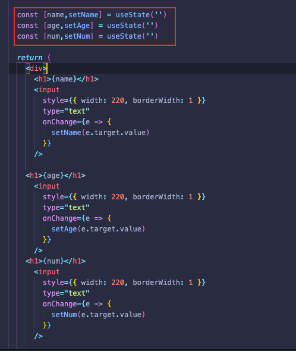

```bash
npm proxy-hooks --save
```

## 基于 proxy 封装的 react-hooks

你是否遇到过一个组件需要维护多个 useState，并且每次更改都需要手动触发回调函数，这样一来的话我们的代码量会逐步上升且臃肿，但是你可能会说组件状态使用 immer 来解决这个问题，不过调用仍是不够优雅，所以才有结合 vue 数据的响应式来很好解决以下这种场景。


