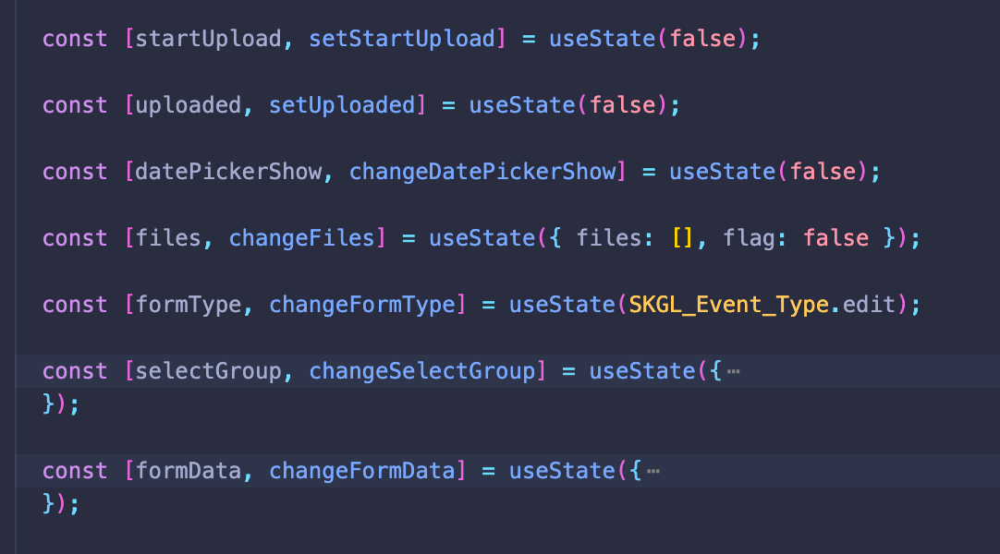

# Home

```bash
npm i v-reactive-hooks --save
```

## 基于 vue3 响应式模块封装的 react-hooks 方法库

你是否曾经遇到过一个组件需要维护多个 useState，并且每次更改都需要手动触发回调函数，这样一来的话我们的代码量会逐步上升且臃肿，但是你可能会说全部状态放到一个对象管理然后使用 useImmer 来解决这个问题，不过仍是每次需要触发回调函数，这次我利用 vue 的核心方法够很好得解决这个问题。



如果我们使用了 useReactive 呢？


